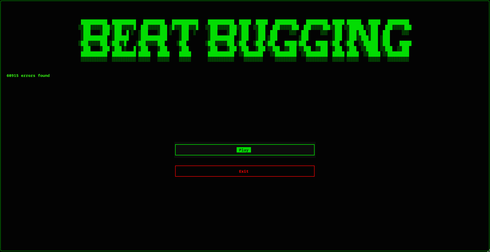
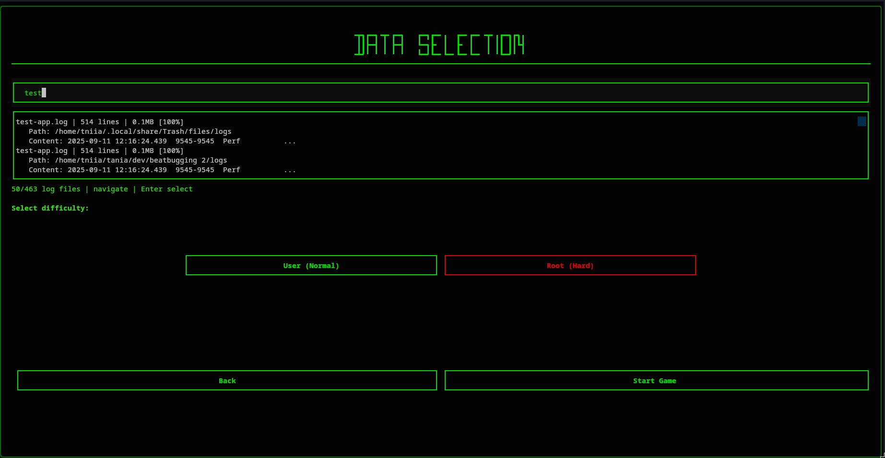
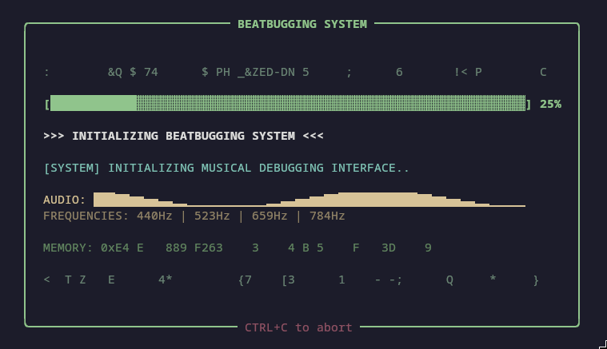
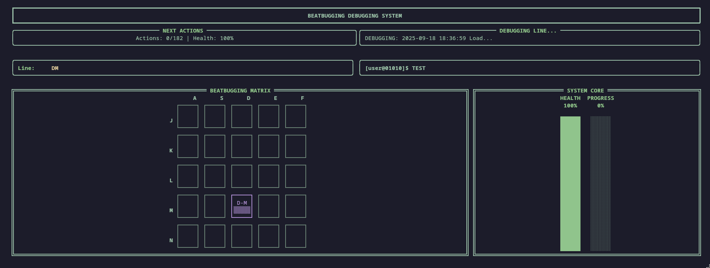
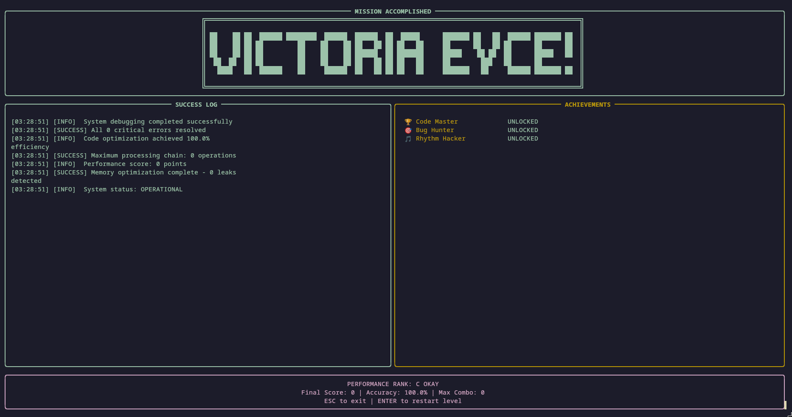
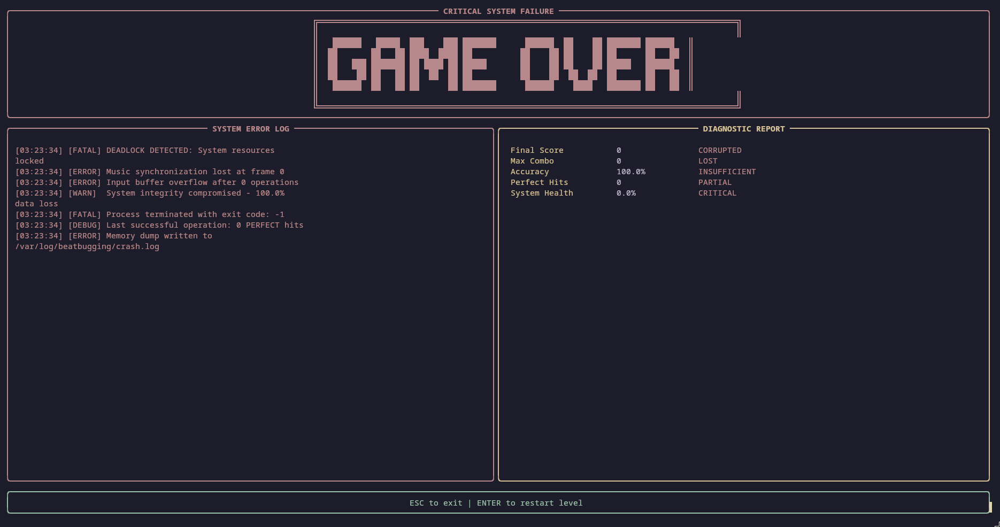

# 🎵 BeatBugging

**Transform System Logs into Rhythmic Debugging Adventures**

```
██████╗ ███████╗ █████╗ ████████╗██████╗ ██╗   ██╗ ██████╗  ██████╗ ██╗███╗   ██╗ ██████╗ 
██╔══██╗██╔════╝██╔══██╗╚══██╔══╝██╔══██╗██║   ██║██╔════╝ ██╔════╝ ██║████╗  ██║██╔════╝ 
██████╔╝█████╗  ███████║   ██║   ██████╔╝██║   ██║██║  ███╗██║  ███╗██║██╔██╗ ██║██║  ███╗
██╔══██╗██╔══╝  ██╔══██║   ██║   ██╔══██╗██║   ██║██║   ██║██║   ██║██║██║╚██╗██║██║   ██║
██████╔╝███████╗██║  ██║   ██║   ██████╔╝╚██████╔╝╚██████╔╝╚██████╔╝██║██║ ╚████║╚██████╔╝
╚═════╝ ╚══════╝╚═╝  ╚═╝   ╚═╝   ╚═════╝  ╚═════╝  ╚═════╝  ╚═════╝ ╚═╝╚═╝  ╚═══╝ ╚═════╝ 
```

> **OH NO, the system crashed!** You open the logs, sit on your hacker's chair and now... IT'S TIME TO BEATBUGGING!

[](LICENSE)
[](https://www.python.org/)
[](https://github.com/topics/fortheloveofcode)

> **BeatBugging** revolutionizes debugging by turning system logs into playable music. Built for the **GitHub "For the Love of Code" Hackathon** - **Category 4: Game on** 🎮

*Code is your controller. Transform the mundane task of debugging into an epic rhythm game adventure!*

## 🎬 Demo

<div align="center">
<video width="50%" controls>
<source src="img/gameplay.mp4" type="video/mp4">
Your browser does not support the video tag.
</video>
</div>

## 📸 Screenshots

### Main Menu
<div align="center">

</div>

### Data Selection
<div align="center">

</div>

### Loading Screen
<div align="center">

</div>

### Gameplay
<div align="center">

</div>

### Victory Screen
<div align="center">

</div>

### Win Screen
<div align="center">

</div>

### Game Over
<div align="center">

</div>

### Skull Icon
<div align="center">

</div>

## 🎯 What Makes This Special?

**BeatBugging** takes two completely unrelated things - **system debugging** and **rhythm games** - and mashes them together into something surprisingly addictive. Every bug becomes a beat, every error becomes a note, and every successful fix becomes a perfect combo!

### 🎵 **Musical Log Analysis**
Your boring system logs become **actual music**:
```python
# This log line...
2025-09-23 12:16:24.503  ERROR  pdv.test.app  Invalid ID 0x00000000.

# Becomes this musical note at coordinate "AJ" with sawtooth wave!
```

### 🎮 **Rhythm Game Mechanics**
- **5×5 Grid Gameplay** - Hit coordinate combinations like a pro debugger
- **Musical Timing** - Each log entry appears exactly when its "note" plays
- **Perfect/Good/Okay/Miss** - Debug with precision or watch your system crash!
- **Combo System** - Chain successful fixes for massive score multipliers
- **Health System** - Too many missed bugs = system failure!

### 🛠️ **Built for Developers, By Developers**
- **Real Log Files** - Scan your actual system logs (`/var/log`, user logs, etc.)
- **Smart File Detection** - Automatically finds and previews log files
- **Multiple Formats** - JSON logs, Logcat, timestamped entries, raw text
- **Difficulty Modes** - User (Normal) and Root (Hard) for different skill levels

## 🚀 Quick Start

### Prerequisites
- **Python 3.8+** 
- **Audio device** 
- **Log files to debug!** (the game will find them for you)

### Installation & Play

```bash
# Clone this epic debugging adventure
git clone https://github.com/sandra-aliaga/beatbugging.git
cd beatbugging

# Set up your debugging environment
python -m venv venv
source venv/bin/activate  # Windows: venv\Scripts\activate

# Install the rhythm debugging engine
pip install -r requirements.txt

# START BEATBUGGING! 🎵
python main.py
```

**That's it!** The game will auto-scan for log files and get you debugging to the beat!

## 🎮 How to Play Like a Pro

### 1. **Choose Your Debugging Challenge**
- Browse auto-discovered log files with fuzzy search
- See file previews, line counts, and content samples
- Pick your poison: **User (Normal)** or **Root (Hard)**

### 2. **Master the Debug Controls**
```
Columns: A S D E F  (left hand)
Rows:    J K L M N  (right hand)

Hit combinations: A+J, S+K, D+L, E+M, F+N
```

## 🛠️ Technical Innovation

### **The Log-to-Music Algorithm**
```python
def create_musical_note(log_line):
    # SHA-256 hash ensures same logs = same music
    hash_value = hashlib.sha256(log_line.encode()).hexdigest()
    
    # Map to musical coordinates
    column = COLUMNS[int(hash_value[:2], 16) % 5]  # A-F
    row = ROWS[int(hash_value[2:4], 16) % 5]       # J-N
    coordinate = f"{column}{row}"
    
    # Severity determines waveform
    if "ERROR" in log_line: return sawtooth_wave(frequency)
    if "WARN" in log_line:  return square_wave(frequency)
    if "INFO" in log_line:  return triangle_wave(frequency)
    return sine_wave(frequency)  # DEBUG
```

## 📦 Dependencies & Tools

```json
{
  "core_engine": {
    "numpy": "High-performance audio array processing",
    "pygame": "Real-time audio playback and mixing"
  },
  "game_interface": {
    "rich": "Beautiful terminal rendering and layouts", 
    "textual": "Modern CLI application framework"
  },
  "no_paid_services": "100% free and open source!",
  "setup_time": "< 2 minutes from clone to play"
}
```

**Zero paid services required** - just Python and the love of turning bugs into beats! 🎵


## 🏆 For the Love of Code - Category 4: Game on

**Why BeatBugging fits perfectly:**

```
┌─────────────────────────────────────────────────────────┐
│ "Code is your controller"                               │
│ → Your actual log files become the game content         │
│                                                         │
│ "Fun first, functional close behind"                    │
│ → Turns boring debugging into addictive gameplay        │
│                                                         │
│ "Interactive experience"                                │
│ → Real-time rhythm game with immediate feedback         │
│                                                         │
│ "Completely original"                                   │
│ → Nobody has ever made debugging this fun before!       │
│                                                         │
│ "Mashing up genres"                                     │
│ → DevOps tools + Rhythm games = Pure innovation         │
└─────────────────────────────────────────────────────────┘
```

*Built with pure joy for the art of coding and the love of making developers smile while they debug!*


### #ForTheLoveOfCode 🧡
**Category 4: Game on** 🎮

*"Every bug deserves a beat, every error needs a rhythm, and every crash calls for a crescendo!"*

**Making the world's most boring task into the most epic musical adventure - because debugging should be this fun!**

---

## 🆘 Need Help Debugging the Debugger?

- **🐛 Found a bug?** [Open an issue](https://github.com/sandra-aliaga/beatbugging/issues) 
- **💡 Epic idea?** [Start a discussion](https://github.com/sandra-aliaga/beatbugging/discussions)
- **❓ How does this magic work?** The code is well-documented - dive in!
- **🎵 Want to jam?** Tag your gameplay with `#ForTheLoveOfCode`


## 📄 License

MIT License - hack away and spread the debugging joy!

---

**Built with ❤️ for the GitHub "For the Love of Code" Hackathon**


*P.S. - Yes, this actually works. Yes, it's surprisingly addictive. Yes, you'll never look at log files the same way again.* 🎵🐛🎮