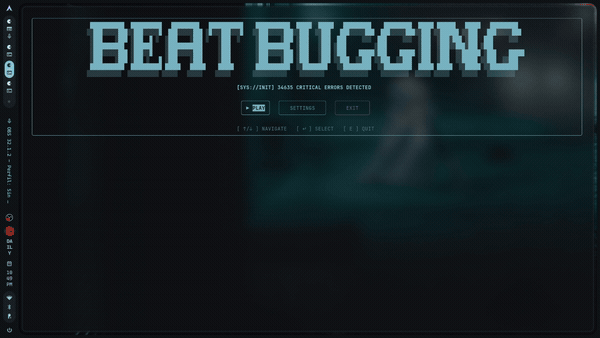

<div align="center">

</div>

[](LICENSE)
[](https://www.python.org/)
[](https://github.com/topics/fortheloveofcode)

**OH NO. The system crashed.**

You open the terminal. You open the logs. You sit in your hacker chair and stare at 50,000 lines of pure chaos.

But wait. Do you hear that?

*Every error has a frequency. Every warning has a rhythm. Every crash... has a beat.*

**IT'S TIME TO BEATBUGGING.**

---

BeatBugging is a terminal rhythm game that turns your real log files into music. Load any `.log` file — your system logs, your app logs, your 1M-line production disaster — and the game hashes each line to generate a unique song. Your keyboard is your instrument. Hit the beats or watch the system die.

Built for the **GitHub "For the Love of Code" Hackathon** — Category 4: Game on.

---

## Demo

### Full game walkthrough

<div align="center">

</div>

### Listen mode — just the music, no input required

<div align="center">

</div>

---


## How it works

Each log line is hashed with SHA-256 to deterministically assign it a grid coordinate and a waveform. Same logs, same song — every time.

The severity of the entry determines the sound:

```
ERROR  ->  sawtooth wave    (aggressive, distorted)
WARN   ->  square wave      (sharp, punchy)
INFO   ->  triangle wave    (clean, melodic)
DEBUG  ->  sine wave        (smooth, quiet)
```

Every line becomes a note on a 5x5 grid. The game plays the song. You hit the coordinates in time. Miss too many and the system dies for real.

---

## Controls

```
  Columns:  A  S  D  E  F     (left hand, home row)
  Rows:     J  K  L  M  N     (right hand, home row)

  To hit coordinate AJ:  press A, then J.
  To hit coordinate DL:  press D, then L.
```

The grid flashes green when a note is live. Hit it. Don't miss it. Combo or die.

---

## Quick start

```bash
git clone https://github.com/sandra-aliaga/beatbugging.git
cd beatbugging
./install.sh

beatbugging
```

The installer sets up a virtualenv and adds a `beatbugging` command to `~/.local/bin`. Restart your terminal (or `source ~/.bashrc`) if the command isn't found right away.

You can also point it at a specific directory:

```bash
beatbugging /path/to/your/logs
```

### Manual setup

```bash
python3 -m venv venv
source venv/bin/activate
pip install -r requirements.txt
python main.py
```

---

## File discovery

On launch the game scans for `.log` files across:

- Current working directory
- `/var/log`
- `~/.local/share`
- `/tmp`
- Your entire home directory (dotfile dirs and build artifacts skipped automatically)
- Any extra path passed as a CLI argument

Files appear in real time as they're found. Fuzzy search to filter. Sorted by line count — the bigger the log, the longer the song.

---

## Settings

Four color themes available in-game:

```
Matrix    green   — the one true hacker aesthetic
Blood     red     — high-alert, maximum stress
Ocean     blue    — calm seas, deadly logs
Phosphor  amber   — vintage CRT from the before-times
```

Also configurable: musical scale (minor / major) and planet aspect ratio for the rotating ASCII sphere on the end screens.

---

## Dependencies

| Package      | Purpose                              |
|-------------|--------------------------------------|
| `numpy`      | Audio synthesis and waveform math    |
| `pygame-ce`  | Real-time audio playback             |
| `rich`       | Terminal rendering and layout        |

No paid services. No cloud. No accounts. Just Python, your logs, and the rhythm.

---

## License

MIT — hack away.

---

*Built with reckless joy for the GitHub "For the Love of Code" Hackathon.*  
*#ForTheLoveOfCode — Category 4: Game on*
